# Deskew Scanned Document 
  ### Deskewing document is one of the essemtial preprcessing before OCR and HTR. This repo contain proposed method for document deskewing mainly via Fourier Transform
## Techniques
---
+ **Fourier Transform**
  
>[Fast Fourier Transform](https://pythonnumericalmethods.berkeley.edu/notebooks/chapter24.03-Fast-Fourier-Transform.html)

---
+ **Non Local Mean Denoising**

>[Article about NLMD](http://www.ipol.im/pub/art/2011/bcm_nlm/article.pdf)

>[Implementation from scratch](http://dsvision.github.io/an-approach-to-non-local-means-denoising.html)

___

## Requirements
+ OpenCV
+ Scikit-image
+ Numpy
____
## Pseudocode
+ `Change image to gray format`
+ `Morphological operations`
+ `Fast Fourier Transform`
+ `FNlM Denoising and thresholding of FFT output`
+ `Determines the peaks`
+ `Calculate angle using slope of drawing line`

## P.S.
*This method works well if angle of skew is between -60 and 60 degrees*

___
## Vizualisation of each step
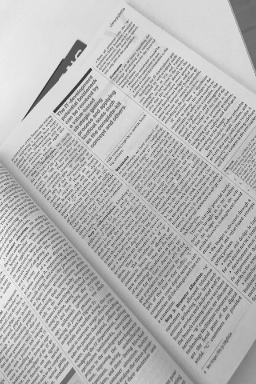</img>
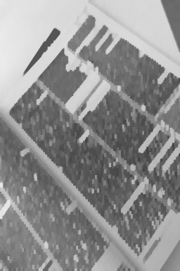</img>
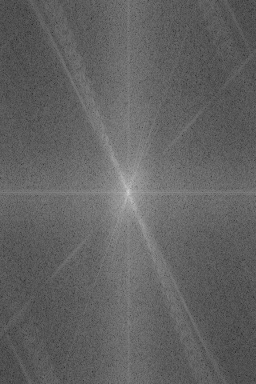</img>
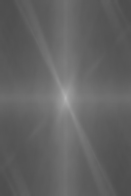</img>
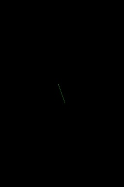</img>
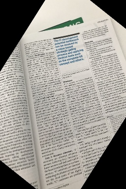</img>

<!-- 

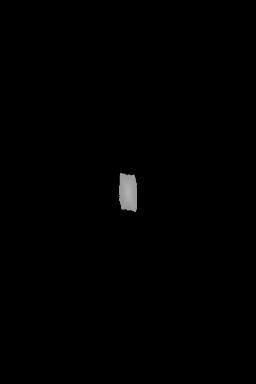

 -->
___

## Synthetic test
**In this test document manually rotated from -60 to 60 degree and check performance of methdod.  
Rotate -60 degree                       | Deskew 63 degree  
:-----------------------------------:|:-------------------------:
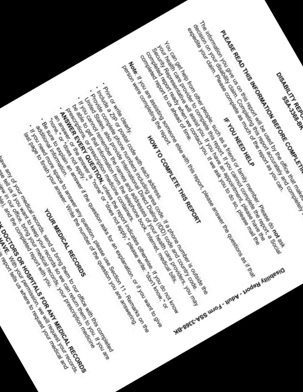</img> | </img>

Rotate -50 degree                       | Deskew 53 degree  
:-----------------------------------:|:-------------------------:
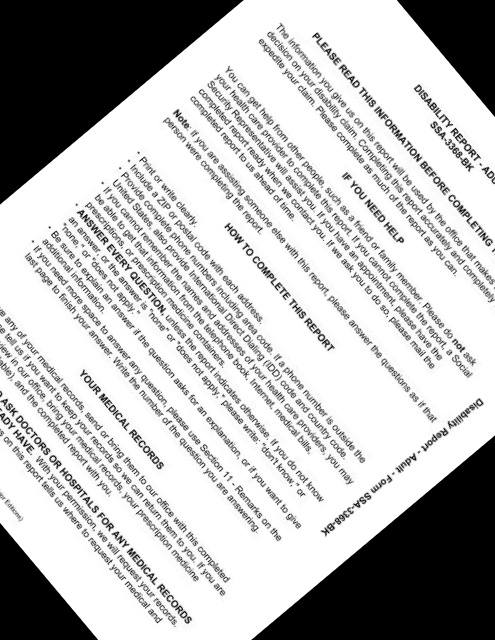</img> | </img>

Rotate -40 degree                       | Deskew 46 degree  
:-----------------------------------:|:-------------------------:
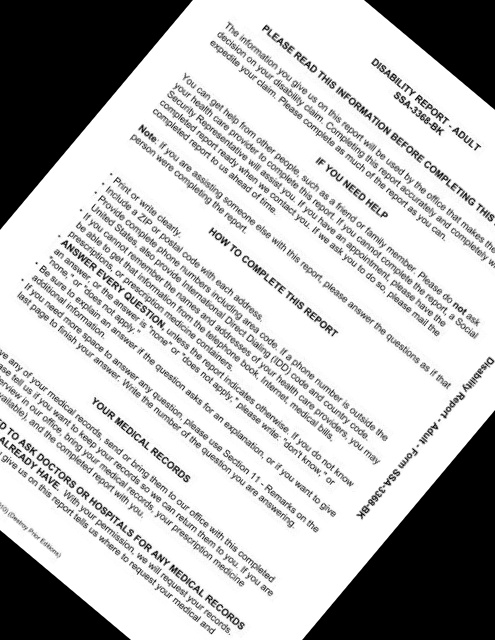</img> | </img>

Rotate -30 degree                       | Deskew 35 degree  
:-----------------------------------:|:-------------------------:
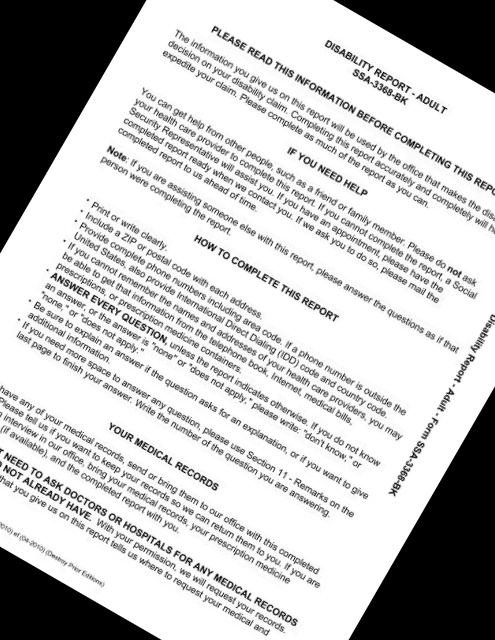</img> | </img>

Rotate -20 degree                       | Deskew 25 degree  
:-----------------------------------:|:-------------------------:
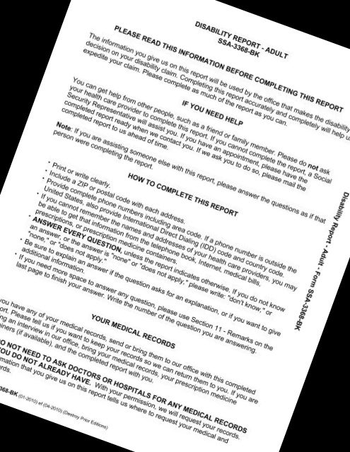</img> | </img>

Rotate -10 degree                       | Deskew 12 degree  
:-----------------------------------:|:-------------------------:
</img> | </img>

Rotate 10 degree                       | Deskew -12 degree  
:-----------------------------------:|:-------------------------:
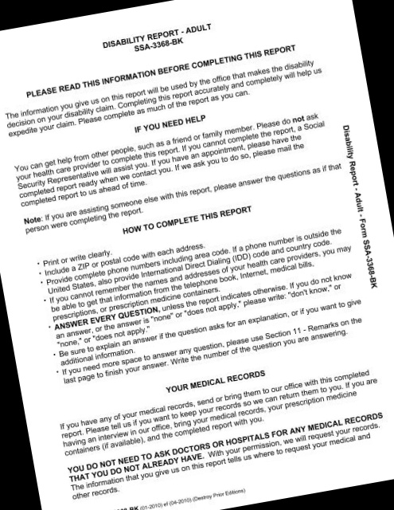</img> | </img>

Rotate 20 degree                       | Deskew -24 degree  
:-----------------------------------:|:-------------------------:
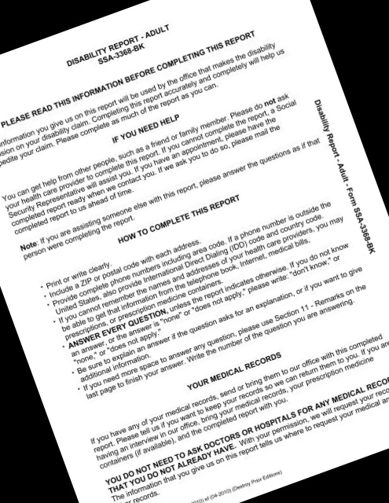</img> | </img>

Rotate 30 degree                       | Deskew -35 degree  
:-----------------------------------:|:-------------------------:
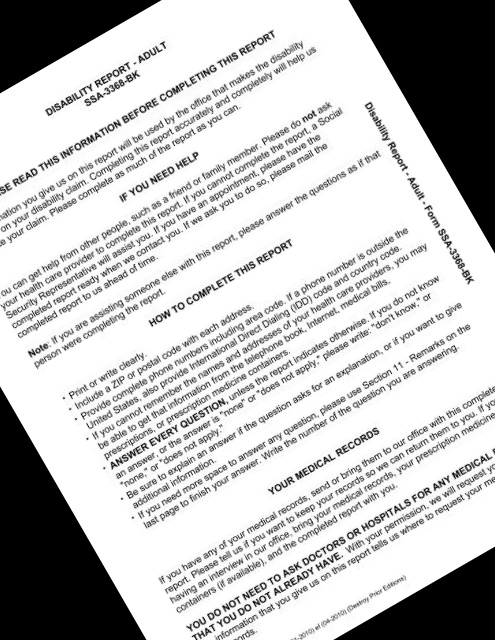</img> | </img>

Rotate 40 degree                       | Deskew -47 degree  
:-----------------------------------:|:-------------------------:
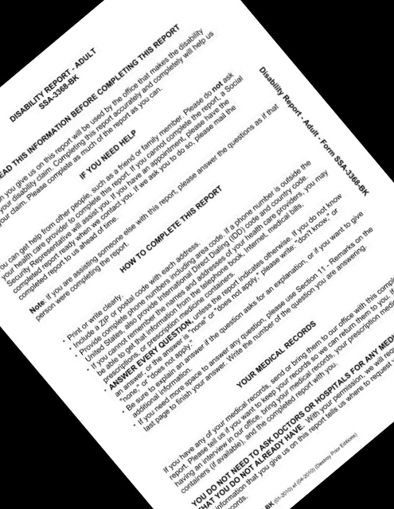</img> | </img>

Rotate 50 degree                       | Deskew -55 degree  
:-----------------------------------:|:-------------------------:
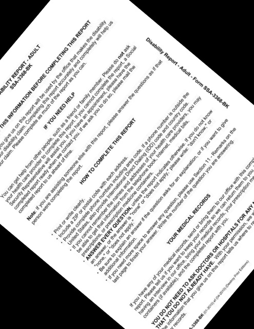</img> | </img>

Rotate 60 degree                       | Deskew -65 degree  
:-----------------------------------:|:-------------------------:
</img> | </img>

<!-- 
 
 
 
 
 
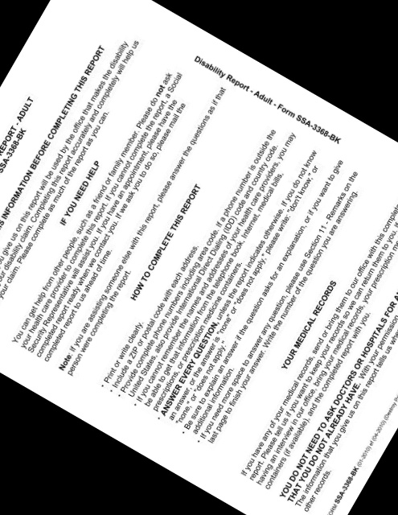  --> -->
___

